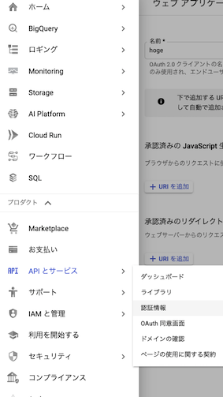
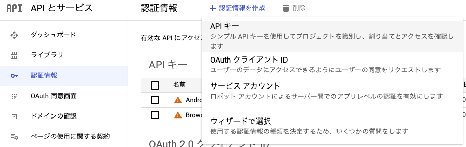
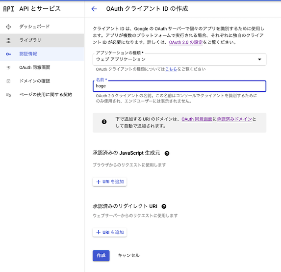
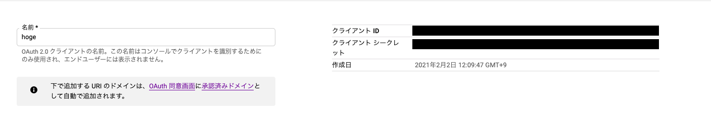
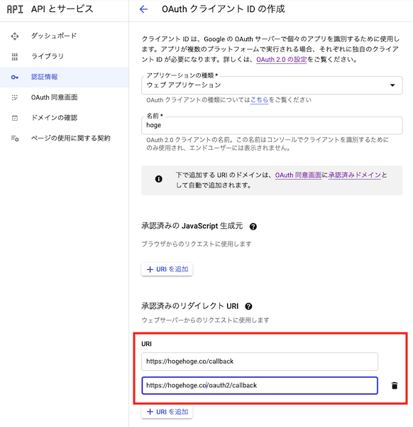
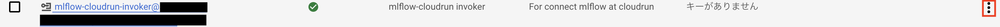

# Cloud Run 認証付き実験管理ダッシュボード


## 使い方

1. GCPのプロジェクトにterraform状態を保存するバケットを作る。
1. 認証情報の設定をGCPのプロジェクトで作る。
1. terraformの変数の設定を更新する。
1. `terraform init` →　`terraform apply`　（後述）
1. github actionsのワークフローを起動するために、github secretsのアップデート

github actionsの稼働が要らないのであれば、1.と5.は不要です。

## 必要な環境
- gcloud CLIコマンド
- terraform

Optional Aを参照

## 0. GCPの設定

### 0-1. 認証情報の設定

ナビゲーションメニューから　`APIとサービス`→`認証情報`を選択



`+認証情報を作成`→`OAuthクライアントID`をクリックする。




`アプリケーションの種類`のプルダウンから、`ウェブアプリケーション`を選択して名前を適当につけて、作成します。




ここで得られる`クライアントID`と`クライアントシークレット`をterraform実行時に使います。




### 0-2. terraform stateを保存するバケットの作成（Optional)

```bash
export PROJECT_ID=$(gcloud info --format='value(config.project)')
gcloud config set project $PROJECT_ID
expoert TF_BUCKET=${PROJECT_ID}-tfstate-hoge
gcloud mb gs://${TF_BUCKET}
```

`TF_BUCKET`は`infra/tf-tensorboard`または`infra/tf-mlflow`以下の`provider.tf`の
```terraform

  backend "gcs" {
    bucket = ${TF_BUCKET}
  }
```
を書き換えてください。立ち上げるサービスごとに別々のBUCKETが必要でので、適宜`hoge`を書き換えて使ってください。

## 1. 認証付きダッシュボード

認証したいドメインやメールアドレスの設定は、`infra/tf-tensorboard/pomerium-config`または、`infra/tf-mlflow/pomerium-config/`以下の、`policy.yaml`の設定を[こちら](https://www.pomerium.io/reference/#allowed-idp-claims)を参考に変更してください。

現在`example.com`のドメインのみ許可するように設定しています。

### 1-1. tensorboard
```
git clone （このレポジトリ）
export PROJECT_ID=$(gcloud info --format='value(config.project)')
cd tensorboard-cloudrun
gcloud builds submit --tag asia.gcr.io/${PROJECT_ID}/tensorboard-cloudrun --project ${PROJECT_ID}
```
でgcrコンテナに登録します。(asiaは、データセンターの位置が物理的に近いのでアップロードなどが速いらしい。)

`infra/tf-tensorboard/sandbox.tfvars`の`(YOUR_PROJECT)`と、`(YOUR)/(TENSORBOARD)/(FILEPATH)`の項目を書き換えてください
```
#provider
project = "(YOUR_PROJECT)" ##ここと
region  = "asia-northeast1"
zone    = "asia-northeast1-a"

# cloud run 
dashboard_name         = "tensorboard-cloudrun"
dashboard_cpu          = "1000"
dashboard_memory       = "512"
event_filepath         = "gs://(YOUR)/(TENSORBOARD)/(FILEPATH)"　#ここ
tensorboard_reroadtime = "600"
autoscaling_max_num    = "2"

# auth cloud run 
auth_name              = "pomerium-cloudrun"
auth_cpu               = "1000"
auth_memory            = "512"
secret_pomerium_config = "pomerium-config"
```
github actionsを使ったCI/CDを行わない場合には、
`infra/tf-tensorboard/provider.tf`の

```terraform

  backend "gcs" {
    bucket = ${TF_BUCKET}
  }
```
を削除しておいてください。

設定が終われば、
```
cd infra/tf-tensorboard
terraform init
terraform apply -var-file=sandbox.tfvars \
                -var="idp_client_id=(0-1で取得したクライアントID)" \
                -ver="idp_client_secret=(0-1で取得したクライアントシークレット)"
```
で、サービスがすべて立ち上がるので、OAuth2.0の`承認済みのリダイレクト URI`に認証サーバーのURIを以下のように登録してください。


```
https://（認証サーバーのURL）/callback
https://（認証サーバーのURL）/oauth2/callback
```



#### 使い方

teonsorboardに読み込ませるファイルを任意のGCSのバケットに配置してください。

その場所を`terraform`の`gs://(YOUR)/(TENSORBOARD)/(FILEPATH)`と書き換えてください。

CloudRunにアクセスすればtensorboardが見れます。

### 1-2. mlflow

```
git clone （このレポジトリ）
export PROJECT_ID=$(gcloud info --format='value(config.project)')
cd mlflow-cloudrun
gcloud builds submit --tag asia.gcr.io/${PROJECT_ID}/mlflow-cloudrun --project ${PROJECT_ID}
```

`infra/tf-mlflow/sandbox.tfvars`の`(YOUR_PROJECT)`を自分のプロジェクトに書き換えてください。
```
#provider
project = "(YOUR_PROJECT)" #ここ
region  = "asia-northeast1"
zone    = "asia-northeast1-a"
env     = "sandbox"

# cloud run 
dashboard_name             = "mlflow-cloudrun"
dashboard_cpu              = "2000"
dashboard_memory           = "1024"
autoscaling_max_num        = "4"
mlflow_artifact_store_name = "mlflow-artifact"

# auth cloud run 
auth_name      = "pomerium-mlflow"
auth_cpu       = "1000"
auth_memory    = "512"
encoded_policy = "data"

# db
db_name = "mlflow"
```
github actionsを使ったCI/CDを行わない場合には、
`infra/tf-mlflow/provider.tf`の

```terraform

  backend "gcs" {
    bucket = ${TF_BUCKET}
  }
```
を削除しておいてください。

設定が終われば、
```
cd infra/tf-mlflow
terraform init
terraform apply -var-file=sandbox.tfvars \
                -var="idp_client_id=(0-1で取得したクライアントID)" \
                -ver="idp_client_secret=(0-1で取得したクライアントシークレット)"
```
で、サービスがすべて立ち上がるので、OAuth2.0の`承認済みのリダイレクト URI`に認証サーバーのURIを以下のように登録してください。


```
https://（認証サーバーのURL）/callback
https://（認証サーバーのURL）/oauth2/callback
```


#### 使い方

GCPのナビゲーションメニューから　`IAMと管理`→`サービスアカウント`を選択すると、`mlflow-cloudrun-invvoker@...`というアカウントが作成されています。



上記赤枠から`鍵を作成`→`JSON`を選択すると、ローカルPCに鍵が保存されます。MLflowで学習を保存させる場合にはこの鍵を利用します。

動かすためには以下のライブラリがローカルマシンに必要です。

```
pip install --upgrade google-auth
pip install mlflow
```

使い方の例

```python
import os

from google.auth.transport.requests import AuthorizedSession
from google.oauth2 import service_account
import mlflow

mlflow_url = '(CLOUD_RUN_MLFLOW_URL)'
PATH_TO_CREDENTIAL = '(DOWNLOADED_CREDENTIAL_PATH)'


def set_mlflow_env(mlflow_url):
    creds = service_account.IDTokenCredentials.from_service_account_file(
        PATH_TO_CREDENTIAL,
        target_audience=mlflow_url)

    authed_session = AuthorizedSession(creds)
    authed_session.get(mlflow_url)
    token = creds.token
    os.environ["MLFLOW_TRACKING_TOKEN"] = token

if __name__ == '__main__':
    set_mlflow_env(mlflow_url)
    # DO SOMETHING

    mlflow.set_tracking_uri(mlflow_url)
    mlflow.start_run()
    mlflow.log_param('hoge', hoge)
    mlflow.log_metric('score', your_score)
    mlflow.sklearn.log-model(your_model, "ml_models")
    mlflow.end_run()
```


## 2． github actionsの設定
github actionsをつかってCI/CD化しています。
github secretの以下のパラメータをアップデートしてください。


| パラメータ| 説明 |
| ------------- | ------------- |
| GCLOUD_PROJECT_ID | GCPのプロジェクト名  |
| GCLOUD_SERVICE_KEY | projectのservice account key のcredential |
| IDP_CLIENT_ID | 0-1で取得したクライアントID |
| IDP_CLIENT_SECRET | 0-1で取得したクライアントシークレット |

詳しくは[公式](https://github.com/google-github-actions/setup-gcloud)を参考にしてください。

## 3. github actionsを動かす
terraformが書き換わっているので、pull request→mergeすると、github actionsが動いてGCP上にデプロイされます。

## A.(Optional)Terraformをローカルで動かす場合

ローカル PC から Terraform を実行して GCP の Sandbox 環境を構築する手順を記載します。
GitHub Actions 経由でした Terraform を実行できない様になっています。

### A-1. gcloud sdk のインストール

#### MacOS へのインストール

```shell
# gcloud sdkをDLする．
$ curl https://sdk.cloud.google.com | bash

# インストール スクリプトを実行して、Cloud SDK ツールをパスに追加
$ ./google-cloud-sdk/install.sh

# shell を再起動します。
$ exec -l $SHELL

# GCPにログインする
$ gcloud auth login

# gcloud 環境を初期化します。
$ gcloud init

# クレデンシャルを作成する。
gcloud auth application-default login

# クレデンシャルが作成されたかを確認する。
$ cat ~/.config/gcloud/application_default_credentials.json
```

#### Windows へのインストール

1. [google-cloud-sdk.zip](https://dl.google.com/dl/cloudsdk/channels/rapid/google-cloud-sdk.zip?hl=ja) をダウンロードしてその内容を抽出します（ダウンロードしたファイルを右クリックして [すべて展開] を選択します.）

2. `google-cloud-sdk\install.bat` スクリプトを起動して、インストールの指示に沿って操作します.

3. インストールが完了したら、コマンド プロンプト（`cmd.exe`）を再起動します.

4. gcloud 環境を初期化します。

```shell
C:\> gcloud init
```

### A-2. GCP プロジェクト設定の追加

```shell
# GCPプロジェクトの設定をする．
$ gcloud config configurations create (YOUR_PROJECT)
$ gcloud config set project (YOUR_PROJECT)
$ gcloud config set account (YOUR_EMAIL)@example.com

# 登録したGCPプロジェクト設定の確認
# 例． IS_ACTIVATEが[true]になっているのが有効化されているプロジェクト
$ gcloud config configurations list

NAME              IS_ACTIVE  ACCOUNT                 PROJECT           COMPUTE_DEFAULT_ZONE  COMPUTE_DEFAULT_REGION
default           False      (YOUR_EMAIL)@example.com  (YOUR_PROJECT_ID)  asia-northeast1-a     asia-northeast1
(YOUR_PROJECT)    True       (YOUR_EMAIL)@example.com  (YOUR_PROJECT_ID)

# GCPプロジェクト設定の有効化
$ gcloud config configurations activate (YOUR_PROJECT)
```

### A-3. Terraform のインストール

#### MacOS へのインストール

```shell
# Terraformのバージョン管理ツールtfenvをインストール
$ brew install tfenv

# tfenvでバージョンを指定してterraformをインストール (必ず0.13.5をインストールしてください)
$ tfenv install 0.13.5

# 利用するバージョンを切り替える
$ tfenv use 0.13.5

# 現在インストールしているバージョンを確認する．
$ tfenv list

# TFLintをインストール
$ brew tap wata727/tflint
$ brew install tflint
```

#### Windows へのインストール

1. 次のダウンロードサイトから、環境に合わせてファイルをダウンロード. (必ず 0.13.5 をインストールしてください)

- [Terraform ダウンロードサイト](https://www.terraform.io/downloads.html)

2. ダウンロードした terraform.exe を PATH の通っているフォルダに配置.

3. Terraform 0.13.5 がインストールされたことを確認.

```shell
C:\> terraform --version
```